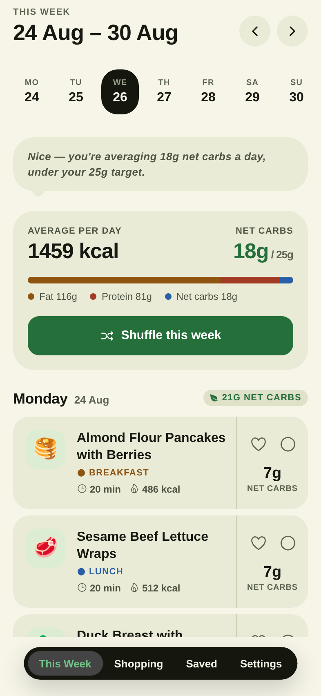
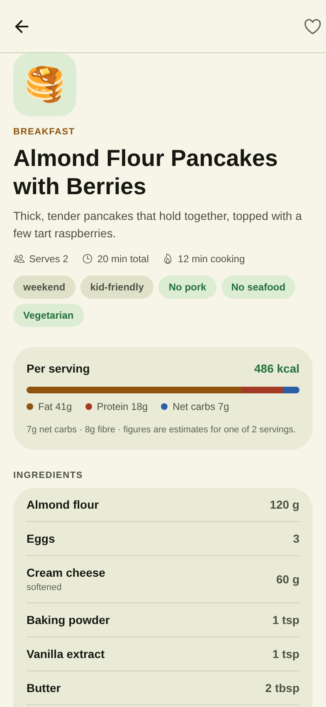
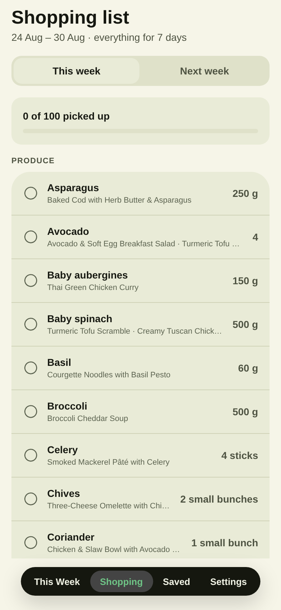
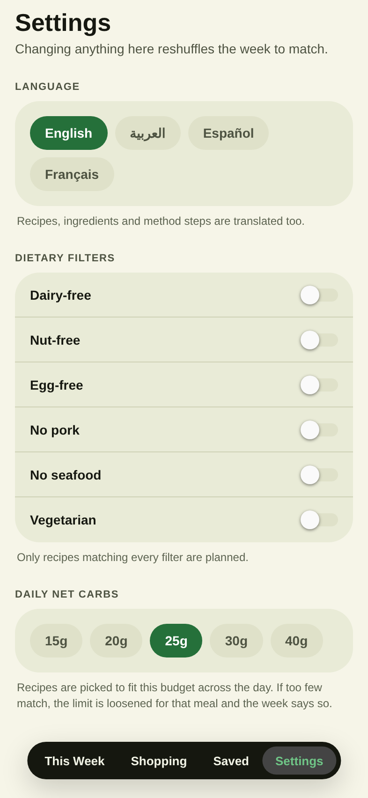
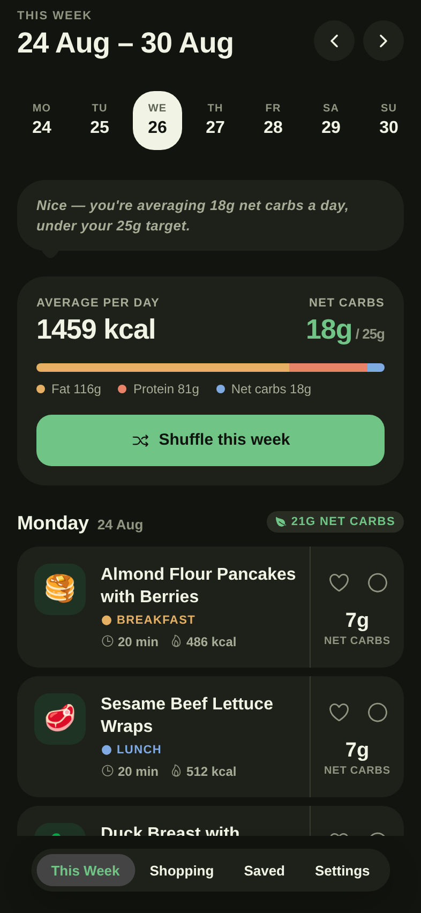
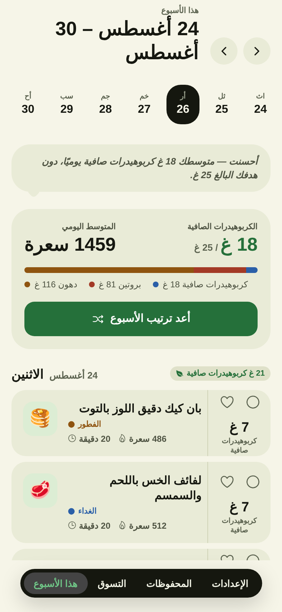
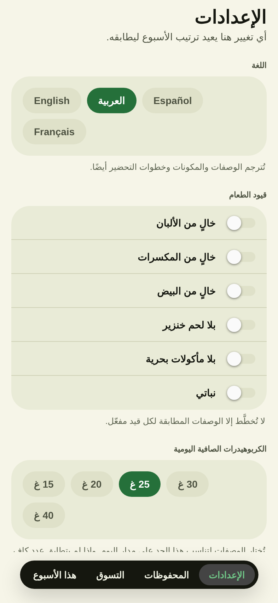
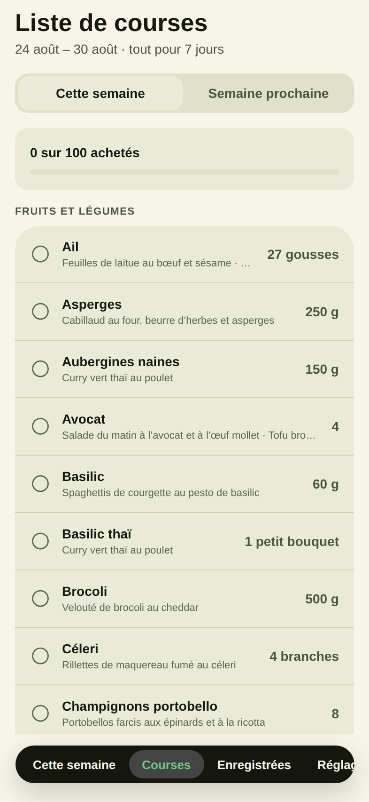

# KetoInSeven

An iOS app, built with React Native and Expo, that hands you a fresh seven-day
keto meal plan every week — with the shopping list already written.

Everything ships inside the app. No account, no API key, no network calls: the
recipe library is bundled, and the week is derived from the date rather than
fetched, so the app works on a plane and costs nothing to run.

## Screenshots

<table>
  <tr>
    <td width="25%"></td>
    <td width="25%"></td>
    <td width="25%"></td>
    <td width="25%"></td>
  </tr>
  <tr>
    <td align="center"><sub><b>This Week</b><br>Seven days, shuffled fresh</sub></td>
    <td align="center"><sub><b>Recipe</b><br>Macros, ingredients, method</sub></td>
    <td align="center"><sub><b>Shopping</b><br>Merged and grouped by aisle</sub></td>
    <td align="center"><sub><b>Settings</b><br>Language and filters</sub></td>
  </tr>
  <tr>
    <td width="25%"></td>
    <td width="25%"></td>
    <td width="25%"></td>
    <td width="25%"></td>
  </tr>
  <tr>
    <td align="center"><sub><b>Dark mode</b><br>Follows the system</sub></td>
    <td align="center"><sub><b>Arabic</b><br>Right-to-left layout</sub></td>
    <td align="center"><sub><b>Language</b><br>Four languages</sub></td>
    <td align="center"><sub><b>French</b><br>Sorted by translated name</sub></td>
  </tr>
</table>

> Rendered from the web build at iPhone size, not from a simulator. The one
> visible difference on iOS is the tab bar, which is a native `UITabBar` with SF
> Symbol icons rather than the text-only bar the web renderer draws. Everything
> else is the same code.

## What it does

- **This Week** — seven days of breakfast, lunch and dinner, with net carbs per
  day against your target, and a bonus snack for the week. Arrows browse into
  past and future weeks; *Shuffle* regenerates the current one.
- **Shopping** — every ingredient for the week rolled into one list, grouped by
  supermarket aisle, with quantities added up across recipes and ticks that
  persist. Switch between this week and next week to shop ahead.
- **Saved** — tap the heart on any recipe to keep it, grouped by meal.
- **Settings** — language, dietary filters, a daily net-carb target, which meals
  to plan, which day the week starts on, and an optional weekly reminder.

## Languages

English, Arabic, Spanish and French. Everything is translated, including recipe
titles, ingredients, preparation notes and every method step — `npm run verify`
fails if any string is left behind.

English is the canonical data. Translations are looked up by the English source
string, so diet filtering, shopping-list merging and the weekly plan seed all
keep operating on English values: changing language never changes which recipes
you get or how ingredients combine. Any missing translation falls back to
English rather than rendering blank.

Arabic reverses the layout. React Native only applies that at launch, so
choosing it asks you to reopen the app.

To add a language: add it to `src/i18n/locales.ts`, then create `ui/<code>.ts`
(the compiler will list every key you still owe), `recipes/<code>.ts` for the
ingredient lexicon, and `recipes/prose/<code>-<slot>.ts` for the recipe text.

## Getting it onto your iPhone

There are three routes, and which one you want depends on whether you have a
paid Apple Developer account ($99/year). Apple does not allow installing an app
onto a device without one, except via Expo Go or a 7-day Xcode signature.

### 1. Expo Go — free, about five minutes

The app runs on your phone inside the Expo Go container. No Apple Developer
account, no Mac, no build step. This is the fastest way to actually hold it.

1. Install **Expo Go** from the App Store.
2. On your computer, with [Node](https://nodejs.org) 20+ installed:

   ```bash
   git clone -b claude/keto-recipes-ios-app-25bxwz \
     https://github.com/onegega/KetoInSeven.git ketoinseven
   cd ketoinseven
   npm install
   npm start
   ```

   The `-b` matters: the app lives on that branch, and the default branch is
   still empty.
3. Scan the QR code in the terminal with the iPhone camera.

Your phone and computer must be on the same Wi-Fi. If the office network blocks
device-to-device traffic, run `npx expo start --tunnel` instead.

**"Project is incompatible with this version of Expo Go."** Expo Go only runs
the SDK it was built for. This project targets **Expo SDK 54** (React Native
0.81, minimum **iOS 15.1**), which is what Expo Go client 1017756 carries.

Check what your copy supports under Expo Go → Settings → App Info → Supported
SDK. If that number is above 54 you are on a newer Expo Go than this project
expects and can move the whole project forward; if it is below 54, update Expo
Go from the App Store — search for it rather than trusting the Updates tab,
which hides apps set to auto-update.

The SDK is deliberately pinned rather than tracking the newest release, because
Expo Go carries exactly one SDK and there is no point being ahead of it. A
development or TestFlight build embeds its own copy and has no such limit.

**Still incompatible after pulling a change to the SDK?** Expo reads the SDK
version from `node_modules/expo`, *not* from `package.json`, so pulling a commit
that changes the pinned version has no effect until you reinstall. Check what
your checkout actually has:

```bash
node -p "require('./node_modules/expo/package.json').version"
```

`npm run check-sdk` compares the two and prints the same thing; it also runs
automatically before `npm start`, so a mismatched tree refuses to launch rather
than failing later on the phone.

If the two disagree, clear the tree out and reinstall — a plain `npm install`
over an existing one does not reliably downgrade:

```bash
rm -rf node_modules package-lock.json .expo
npm install
npx expo start -c        # -c clears the Metro cache, which also holds the manifest
```

Then confirm before scanning anything:

```bash
npx expo config --type public | grep sdkVersion
```

What you give up: it appears as a project inside Expo Go rather than as its own
home-screen icon, it only runs while the dev server is up, and notification
behaviour differs from a real build.

### 2. EAS Build, installed over the air — needs a paid Apple Developer account

This produces a real signed app with its own icon, installed from a link. The
build runs on Expo's servers, so this works from macOS, Windows or Linux.

```bash
npm install -g eas-cli
eas login                          # free Expo account
eas build --platform ios --profile preview
```

EAS will ask for your Apple credentials and create the signing certificate and
provisioning profile for you. It also has to register your iPhone's UDID —
`eas device:create` walks you through it, and **the device must be registered
before the build runs**, since ad-hoc provisioning bakes the device list into
the binary.

When the build finishes, open the link it prints on the iPhone and install.

### 3. TestFlight — needs a paid Apple Developer account

The real app, on your home screen, no dev server, no 7-day expiry. Builds run on
Expo's servers, so this works from macOS, Windows or Linux.

**As an internal tester on your own account there is no App Review.** The build
is usable minutes after Apple finishes processing it. Beta App Review only
applies to external testers — people outside your team, invited by public link.

#### One-time setup

1. Enrol in the [Apple Developer Program](https://developer.apple.com/programs/)
   ($99/year). Enrolment can take a day or two to be approved.
2. Create a free [Expo account](https://expo.dev/signup).
3. Install the CLI and sign in:

   ```bash
   npm install -g eas-cli
   eas login
   ```

#### Every build

```bash
eas build --platform ios --profile production
eas submit --platform ios --latest
```

The first `build` asks for your Apple ID and then creates the distribution
certificate, provisioning profile and App Store Connect app record for you.
Say yes when it offers — there is nothing to set up by hand in the Apple portal.
Expect 15-25 minutes for the first build, less afterwards.

`submit` uploads to App Store Connect. Apple then takes 5-15 minutes to process
the binary before it appears in TestFlight.

#### Getting it onto your phone

1. Install **TestFlight** from the App Store.
2. In [App Store Connect](https://appstoreconnect.apple.com) → your app →
   TestFlight → Internal Testing, create a group and add your Apple ID.
3. Accept the invite email on the iPhone. TestFlight installs it.

Builds expire after 90 days, so a long-lived install means rebuilding roughly
quarterly.

#### Two names Apple requires to be unique

- **Bundle identifier** — `app.json` sets `ios.bundleIdentifier` to
  `com.ketoinseven.app`. It has to be unique across every app Apple knows about. If
  registration fails because someone already holds it, change it to
  `com.yourname.ketoinseven` and rebuild.
- **App Store Connect name** — must also be unique store-wide, so "KetoInSeven" may
  be taken. That name is only the App Store listing; the name under the icon on
  your home screen comes from `expo.name` in `app.json` and can stay "KetoInSeven"
  regardless.

Change the bundle identifier *before* you first install, not after. Apple treats
a new identifier as a different app, so the saved recipes and shopping ticks on
the old one will not carry over.

#### Checking the config before you burn a cloud build

A failed EAS build costs 20 minutes. This generates the native iOS project
locally and fails fast if anything in `app.json` is wrong, without needing a Mac:

```bash
npx expo prebuild --platform ios --no-install
rm -rf ios          # throw it away; the native folders are generated, not committed
```

It also rewrites the `ios` and `android` entries in `package.json` to
`expo run:*`. Undo that with `git checkout package.json` — this project stays in
the managed workflow, where EAS generates the native project at build time.

#### Already handled for you

- `ios.config.usesNonExemptEncryption` is set to `false` in `app.json`. The app
  makes no network calls and uses no cryptography of its own, so this is
  accurate, and it stops App Store Connect holding each build for a manual
  export-compliance answer.
- The app icon is generated without an alpha channel. Apple rejects icons that
  carry one (ITMS-90717) even when every pixel is opaque.
- `appVersionSource` is `remote` with `autoIncrement` on the production profile,
  so EAS assigns a fresh build number each time. Apple refuses a build number it
  has already seen.
- `supportsTablet` is `true`, so this installs on an iPad too. If you ever
  submit to the public App Store, that commits you to providing iPad
  screenshots — set it to `false` in `app.json` to avoid that.

One thing you do have to do: the first `eas build` writes an `extra.eas.projectId`
into `app.json`, linking the repo to a project on Expo's servers. Commit that
change — without it, later builds create a second project instead of adding to
this one.

## How the weekly rotation works

The plan is never stored — it is *derived*, which is why reopening the app on
Thursday shows the same week it showed on Monday, on any device, with no server
involved.

A seed is built from the week's start date, your preferences and how many times
you have shuffled that week. That seed drives a small PRNG
(`src/lib/rng.ts`) which shuffles the eligible recipes for each meal slot; day
*n* takes entry *n* from the shuffled queue. Same inputs, same week, every time.
Changing a preference or shuffling changes the seed, and the week changes with
it.

Eligibility is diet flags first, carb budget second. If too few recipes match,
the carb budget is dropped before the diet flags are — running a few grams over
is a smaller betrayal than serving someone the food they excluded — and the app
says on the plan screen when either has happened.

## The look

Cream paper, ink, one green, and a colour per meal.

Two rules do most of the work, and both live in `src/constants/theme.ts`:

**Separation comes from fill, not from outlines.** Cards are a shade *darker*
than the page rather than being fenced off with hairlines. Borders survive only
as dividers inside a grouped list. This is why the page is warm cream and never
white — against white, a filled card reads as a hole.

**Every relationship inverts.** In light mode `surface` is darker than
`background`; in dark mode it is lighter. `inverseSurface` is near-black on
light and near-white on dark. Anything written against "the card stands out
from the page" stays true in both schemes without a second code path. The one
deliberate exception is the tab bar, which stays dark in both — the inversion
that looks confident at the size of a day chip is a glare at the size of a bar.

Meal slots carry fixed colours (breakfast amber, lunch blue, dinner magenta,
snack teal) and so do macros (fat, protein, carbs), so a colour always names the
same thing wherever it appears.

Every foreground/background pairing the UI actually draws is checked against
WCAG contrast by `scripts/check-contrast.js`, which runs inside `npm run
verify`. Retuning a token that would make a label unreadable fails the build
rather than shipping. Run it alone with:

```bash
node scripts/check-contrast.js
```

## Project layout

```
src/
  app/                 expo-router routes (file path = URL)
    (tabs)/            the four tabs
    recipe/[id].tsx    recipe detail
  components/          presentational pieces
  constants/theme.ts   colours, spacing, radii
  data/
    types.ts           Recipe / Ingredient / Macros
    recipes/           the bundled library, one file per meal slot
  lib/                 pure logic: plan, shopping, week maths, rng, storage
  store/               app state + AsyncStorage persistence
scripts/
  check-contrast.js    holds the palette to WCAG contrast ratios
  generate-icons.js    regenerates the app icons as flat PNGs
  verify.js            checks the recipe data and planning logic
```

## Adding your own recipes

Append to the matching file in `src/data/recipes/` — the shape is in
`src/data/types.ts`, and every field is required except an ingredient's `note`.
Give it a unique `id` and never reuse or renumber one that has already shipped:
saved recipes and shopping ticks are keyed by it.

Then run the checks:

```bash
npm run verify     # recipe data + planning logic
npm run typecheck
npm run lint
```

`verify` will tell you if a recipe's stated calories disagree with its macros,
if it is not actually keto, or if a dietary filter no longer has enough recipes
to fill a week without repeating.

## Known limits

- **No photos.** Recipes are identified by an emoji and a colour tile. Adding
  images means either bundling licensed photography or fetching it at runtime,
  which would give up the offline guarantee.
- **Macros are estimates.** They are per serving, hand-entered, and rounded.
  Treat them as a guide, not a measurement.
- **Not medical advice.** A ketogenic diet is not appropriate for everyone.
  Talk to a doctor or dietitian before making a significant dietary change,
  particularly if you are pregnant, diabetic, or taking medication.
